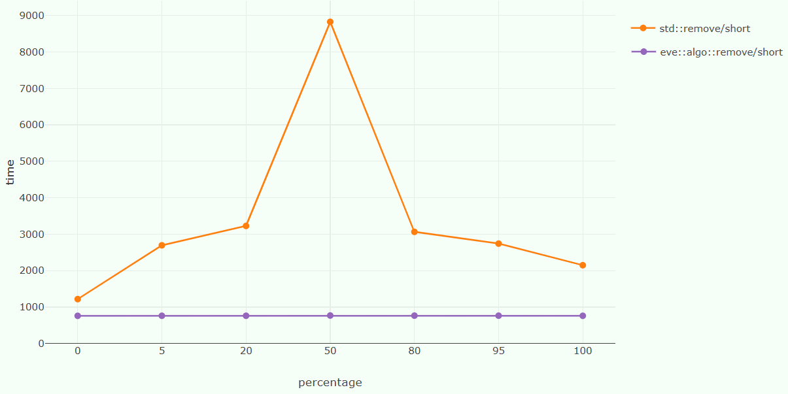

# Summary

SIMD - *Single Instruction Multiple Data* - units have been present in consumer-grade CPUs for more than 25 years. They enable in-core data-level parallelism, increasing the processor throughput and power efficiency relative to the default scalar execution model. Exploiting these hardware units remains challenging to this day, often needing very low-level programming knowledge, architecture-specific code, and specific data layouts. However, using SIMD efficiently is critical to achieve the highest levels of performance on modern processors. Two examples of this can be found in RPCS3, a PlayStation 3 emulator extensively using compiler-provided instrinsics; or ffmpeg, the de-facto standard multimedia codec library which relies on hand-written architecture-specific SIMD code to achieve high-performance audio and video decoding on a wide range of hardware. Interest for SIMD-aware programming is also gaining traction as RISC-V and ARM SVE systems themselves are becoming sought after HPC targets [@diehl:2024].

This paper introduces **E.V.E**, a C++20 implementation of a type-based wrapper for SIMD instruction sets. It provides a type-safe, user-friendly interface for more than 500 numerical functions implemented across the majority of existing SIMD instruction sets from major vendors, including SSE and AVX to AVX512 variants, PowerPC VSX, and ARM NEON and SVE. **E.V.E** also provides higher-level abstraction for guaranteed vectorisation of non-trivial algorithms and data layout. After describing the state-of-the-art tools for writing efficient SIMD code, we'll explain how **E.V.E**'s API simplifies the exploitation of SIMD hardware, ensures performance and flexibility, thus enabling scientists to write domain-rich algorithms without sacrificing performance.

# Statement of need

All modern processors support SIMD instructions, from mobile devices to high-end server chips. Harnessing the power of these compute units can still be tricky. Compilers' auto-vectorization has improved significantly in the last few years [@huber:21], but remains unreliable for complex code or specific use cases where achieving the highest available performance is critical. Modern scientific simulations [@pennycook:13], data analysis [@aguerrebere:2023], liner algebra [@kuhn:23] and machine learning models operate on massive datasets and high-dimensional spaces. If using distributed computing or GPUs improves those workloads, explicit SIMD usage can deliver an additional order of magnitude of speedup. Thus, costs would decrease, workloads would increase, and the exploitation of research results would accelerate.

The main challenge of explicit SIMD usage is the large variety of instructions sets and sub-sets across architectures or even inside a given architectures. Each of those instructions sets propose their own naming scheme, register handling strategies and features as shown in the following table.

| ISA | Extension | Registers size | Approximate number of instructions |
| :--- | :--- | :--- | :--- |
| **x86** | SSE | 128 bits | 70 |
| | SSE2 | 128 bits | 214 |
| | SSE3 | 128 bits | 227 |
| | SSE4a | 128 bits | 231 |
| | SSSE3 | 128 bits | 227 |
| | SSE4.1 | 128 bits | 274 |
| | SSE4.2 | 128 bits | 281 |
| | AVX | 256 bits | 292 |
| | AVX2 | 256 bits | 223  |
| | AVX-512 | 512 bits | 1000+ |
| **PPC** | VMX | 128 bits | 114 |
| | VMX128 | 128 bits | |
| | VSX | 128 bits| |
| **ARM** | NEON | 128 bits | 467 |
| | SVE/SVE2 | 128-2048 bits | 955 |
| **RISCV** |  | 32-65536 bits | 400+ |


**E.V.E** aims to provide such a modern, efficient, cross-platform and cross-architecture abstraction layer for compilers that provide SIMD intrinsics, enabling developers to write high-performance code targeting SIMD units across a wide range of hardware without incurring the cost of hand-writing architecture-specific intrinsics or assembly code. Similar approachs are in the process of being implemented in other major programming languages standards, such as the C++ SIMD Library proposal [@kretz:12] or Rust's `std::simd` module, underlining the need for such facilities in modern high-performance programming [kretz:15, @pohl:16].

# Functionality

**E.V.E**'s features are :
  + Hardware-agnostic abstraction over **wide registers** of any size on any hardware.
  + Support for vectorization of code over user-defined data structures.
  + Standard-like vectorized algorithms.

## Basic SIMD support
**E.V.E** provides a type-safe and cross-architecture abstraction layer for SIMD registers and instructions. This is achieved by using the `eve::wide`, representing a set of values stored in a SIMD-compatible format. The basic C++ operators (`+`, `-`, `*`, `/`, etc.) are overloaded to perform element-wise (or lane-wise) operations on these types. Richer operations can be performed using the large set of free functions provided by **E.V.E**. These function include basic numerical operations (`sin`, `sqrt`, `max`, etc...), advanced matheamtical functions (Sepcial functions including Bessel, Legendre or Lambert functions, hyperbolic functions, polynomial evaluation schemes, etc...), intra-register reductions, shuffling, and swizzling.

```c++
// example 1
eve::wide<float> example(eve::wide<float> w, float s)
{
  // Every operation is done elementwise
  return eve::sqrt(w * w + s);
}

// example 2
eve::wide<char, eve::fixed<16>> example(eve::wide<char, eve::fixed<32>> w)
{
  auto [ lo, hi ] = w.slice();
  return eve::if_else(lo > hi, lo, eve::zero);
}
```

## User-defined type supports
User-defined types are a staple of high-level code. **E.V.E** currently suppports both enumeration and agregate type data structures as vectorizable types.

### Enumeration and trivial structures
**E.V.E** supports custom user-defined types through its translation mechanism. A struct can be registered as `translatable` by specializing the `eve::translation_of` struct. This trait struct informs **E.V.E** of the inner binary representation of the custom type, which it will use for its functions.

```c++
struct MyType { float v; };
struct eve::translation_of<MyType> { using type = float; };
```

By default, all enums are translatable into their inner representation, the following `MyEnum` will be translatable to `int` and be handled as such by **E.V.E**.

```c++
enum class MyEnum: int {};
```

This means that, for example, `eve::wide<std::byte>` works without any special setup.

### Agregates

**E.V.E** also supports aggregates types. That is, types that are compatible with the kumi tuple protocol.

```c++
#include <iostream>
#include <eve/eve.hpp>

// particle has x,y integral position and a mass
struct particle
{
  int x, y;
  float mass;
};

// Pretty-print of particle
std::ostream& operator<<(std::ostream& os, particle p)
{
  return os << "[(" << p.x << ", " << p.y << ") - m: " << p.mass << "]";
}

// Register as a tuple-like type for EVE
template<>
struct eve::is_product_type<particle> : std::true_type
{};

// Struct must be following the standard tuple protocol
template<std::size_t I>
constexpr auto const& get(particle const& s)
{
  if      constexpr(I==0) return s.x;
  else if constexpr(I==1) return s.y;
  else if constexpr(I==2) return s.mass;
}

template<std::size_t I>
constexpr auto& get(particle& s)
{
  if      constexpr(I==0) return s.x;
  else if constexpr(I==1) return s.y;
  else if constexpr(I==2) return s.mass;
}

template<> struct std::tuple_size<particle> : std::integral_constant<std::size_t,3> {};
template<> struct std::tuple_element<0,particle> { using type = int;   };
template<> struct std::tuple_element<1,particle> { using type = int; };
template<> struct std::tuple_element<2,particle> { using type = float;  };

int main()
{
  // Setup a particle
  eve::wide<particle> p = [](int i) { return particle{2*i,i+3,2.5f+i}; };

  // Initial values
  std::cout << p << "\n";

  // Double the mass
  get<2>(p) *= 2.f;
  std::cout << p << "\n";
}
```

The result of this code is :

```
([(0, 3) - m: 2.5], [(2, 4) - m: 3.5], [(4, 5) - m: 4.5], [(6, 6) - m: 5.5])
([(0, 3) - m: 5], [(2, 4) - m: 7], [(4, 5) - m: 9], [(6, 6) - m: 11])
```

`wide` of tuple-like aggregates behaves themselves as tuple, as shown by the extraction of the mass field. When printed though, they are displayed as an actual SIMD register, showing the proper amount of particle instances.

It is also possible to inherit from `eve::struct_support` to declare an aggregate type in a more succint way:

```c++
#include <iostream>
#include <eve/eve.hpp>
#include <array>

// particle has x,y integral position and a mass
struct particle
     : eve::struct_support< particle
                          , int, int, float
                          >
{};

// Pretty-print of particle
std::ostream& operator<<(std::ostream& os, particle p)
{
  return os << "m="  << get<2>(p)
            << " @(" << get<0>(p) << ", " << get<1>(p) << ")";
}

int main()
{
  // Setup a particle
  eve::wide<particle> p = [](int i) { return particle{2*i,i+3,2.5f+i}; };

  // Initial values
  std::cout << p << "\n";

  // Double the mass
  get<2>(p) *= 2.f;
  std::cout << p << "\n";
}
```

This prints the following when executed:
```
(m=2.5 @(0, 3), m=3.5 @(2, 4), m=4.5 @(4, 5), m=5.5 @(6, 6))
(m=5 @(0, 3), m=7 @(2, 4), m=9 @(4, 5), m=11 @(6, 6))
```
In this specific example, four particles are displayed. This is because the machine on which the code was executed has 128 bits-wide native SIMD types, thus four `int` or `float` can be stored in one native register.

## High-level algorithms

**E.V.E** provides SIMD-enabled analogs for most of the standard C++ algorithms. These functions are compatible with all C++ containers and iterators.

```c++
#include <eve/module/algo.hpp>
#include <span>

auto find_first_outlier(std::span<const float> a, std::span<const float> b, float eps)
{
  return eve::algo::mismatch( a, b
                            , [=](eve::wide<float> x, eve::wide<float> y)
                              {
                                return eve::abs(x - y) < eps;
                              }
                            );
}
```

{ width=20% }

# Statement of interest

**E.V.E** has been presented in multiple conference talks :
 + *"SIMD in C\+\+20: eve of a new era"* at **CppCon 2021** by Joel Falcou and Denis Yaroshevskiy.
 + *"Advanced SIMD Algorithms in Pictures"* at **CppCon 2023**, by Denis Yaroshevskiy.
 + *"From SIMD Wrappers to SIMD Ranges"* at **CppNow 2025**, by Denis Yaroshevskiy and Joel Falcou.
 + *"SIMD Substring in a String"* at **C\+\+Online 2025**, by Denis Yaroshevskiy.
 + *"From Acrobatics to Ergonomics - A Field Report on How to Make Libraries Helpful"* at **Meeting C++ 2025**, by Joel Falcou.

**E.V.E** is also actively used in multiple open-source projects including :
 + STEllAR-GROUP's HPX, [the C++ Standard Library for Parallelism and Concurrency](https://hpx.stellar-group.org/).
 + Intel [ScalableVectorSearch](https://intel.github.io/ScalableVectorSearch).
 + [RageDB](https://ragedb.com/), used at AWS.

# Acknowledgements

We acknowledge contributions from Brigitta Sipocz, Syrtis Major, and Semyeong.

# References
